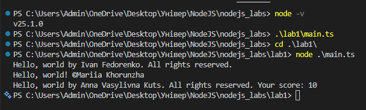
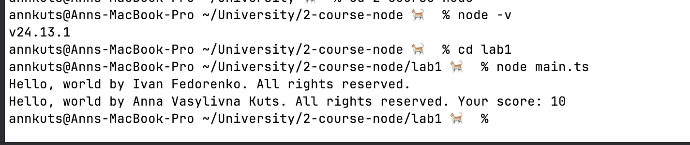
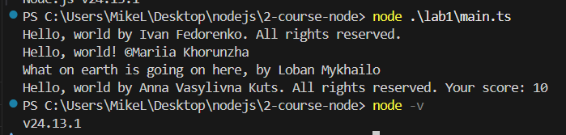

## Lab1. Development Environment Setup

---

## Table of Contents

1. [Work Progress](#work-progress)
2. [Conclusion](#conclusion)
3. [Control Questions](#control-questions)
    1. [Relationship between Chromium, Google Chrome, and Node.js](#1-what-is-the-relationship-between-chromium-google-chrome-and-nodejs)
    2. [JavaScript in Browser vs Node.js](#2-is-there-a-difference-between-running-javascript-in-the-browser-and-in-nodejs)
    3. [TypeScript vs JavaScript](#3-how-does-typescript-differ-from-javascript)
    4. [Cross-Platform Compatibility](#4-what-is-cross-platform-compatibility-are-nodejs-applications-cross-platform)
    5. [Advantages and Disadvantages of Node.js](#5-advantages-and-disadvantages-of-nodejs)
    6. [LTS vs Current](#6-what-is-the-difference-between-lts-and-current-versions)
    7. [Compilation vs Interpretation](#7-advantages-and-disadvantages-of-compilation-vs-interpretation)
    8. [JIT Compilation](#8-how-does-jit-compilation-differ-from-traditional-compilation)
    9. [Static vs Dynamic Typing](#9-what-are-static-and-dynamic-typing)
    10. [Garbage Collector](#10-what-is-the-purpose-of-a-garbage-collector)
    11. [Asynchrony vs Multithreading](#11-what-is-the-difference-between-asynchrony-and-multithreading)

## Work Progress

### 1. Installing Node.js

1. Opened the official website:
   [https://nodejs.org/en](https://nodejs.org/en)
2. Downloaded the latest stable version (LTS).
3. Installed Node.js on the system.

---

### 2.  Verifying the Installation + Installing an IDE + Creating a console application
- An Integrated Development Environment (IDE) was installed by each student (primarily VS Code, IntelliJ IDEA).
- Each student verified the installation by running commands in the terminal
- A simple console application was created to print "Hello, World!" to the console

### Fedorenko Ivan

  

---

### Khorunzha Mariia

  

---

### Kuts Anna

  

---

### Loban Mykhailo

  

---

### Makarevych Bohdan

  

## Conclusion

During this laboratory work, Node.js was successfully installed and configured. The installation was verified through the command line, and a simple console application was created and executed. Basic skills in working with Node.js and the development environment were acquired.

---

# Control Questions

---

### 1. What is the relationship between Chromium, Google Chrome, and Node.js?

* **Chromium** is an open-source web browser project.
* **Google Chrome** is a browser built on Chromium.
* **Node.js** uses the **V8 JavaScript engine**, which was originally developed for Google Chrome.

Both Chrome and Node.js use the same V8 engine to execute JavaScript code.

---

### 2. Is there a difference between running JavaScript in the browser and in Node.js?

Yes.

In the browser:

* Access to the DOM
* `window` object is available
* Designed for client-side applications

In Node.js:

* No DOM
* Access to the file system
* Uses the `global` object
* Designed mainly for server-side development

---

### 3. How does TypeScript differ from JavaScript?

**TypeScript:**

* Statically typed
* Supports interfaces and advanced type features
* Compiles to JavaScript

**JavaScript:**

* Dynamically typed
* Runs directly without a compilation step

---

### 4. What is cross-platform compatibility? Are Node.js applications cross-platform?

Cross-platform compatibility means that software can run on different operating systems without modification.

Node.js applications are cross-platform (Windows, Linux, macOS).

---

### 5. Advantages and disadvantages of Node.js

**Advantages:**

* High performance (V8 engine)
* Asynchronous and non-blocking I/O
* Large npm ecosystem
* Same language for frontend and backend

**Disadvantages:**

* Single-threaded event loop model
* Not ideal for CPU-intensive tasks
* Callback complexity (if not properly structured)

---

### 6. What is the difference between LTS and Current versions?

* **LTS (Long-Term Support)** – stable version recommended for production.
* **Current** – latest version with newest features, but less tested.

---

### 7. Advantages and disadvantages of compilation vs interpretation

**Compilation:**

* Faster execution
* Code optimization

- Requires a build step

**Interpretation:**

* Immediate execution
* Easier debugging

- Slower performance

---

### 8. How does JIT compilation differ from traditional compilation?

**JIT (Just-In-Time) compilation:**

* Compiles code during execution
* Used in the V8 engine

**Traditional compilation:**

* Compiles code before execution

---

### 9. What are static and dynamic typing?

**Static typing:**

* Fewer runtime errors
* Better IDE support

- More verbose code

**Dynamic typing:**

* More flexible
* Less boilerplate

- More runtime errors

---

### 10. What is the purpose of a Garbage Collector?

A Garbage Collector automatically frees memory that is no longer used by the application, preventing memory leaks.

---

### 11. What is the difference between asynchrony and multithreading?

**Asynchrony:**

* Single thread
* Non-blocking operations
* Efficient for I/O tasks

**Multithreading:**

* Multiple threads
* Parallel execution
* Better for CPU-intensive tasks

